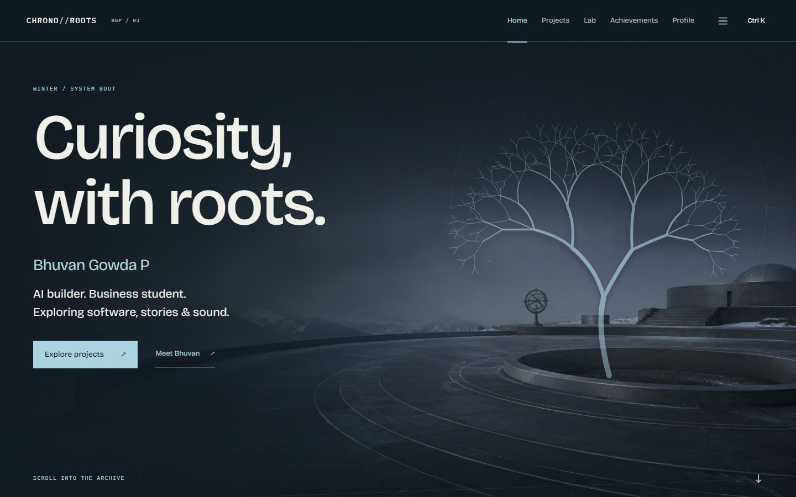
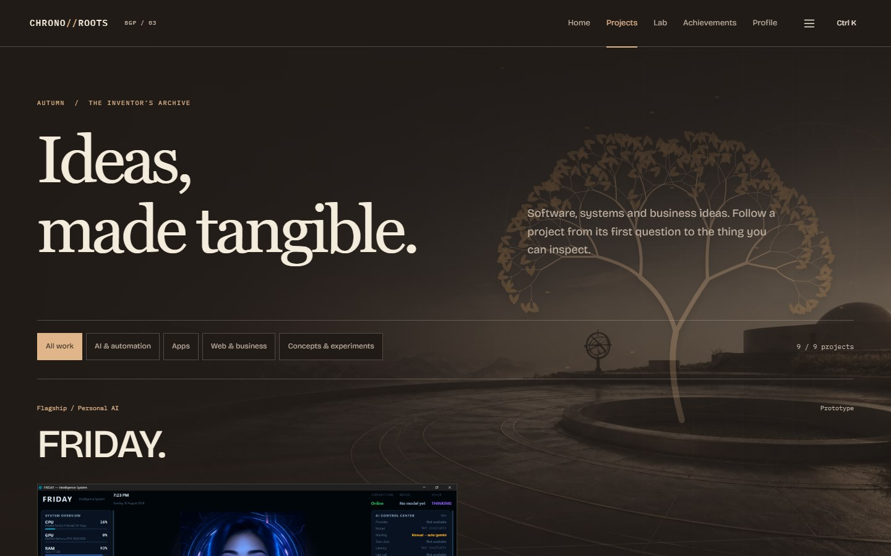
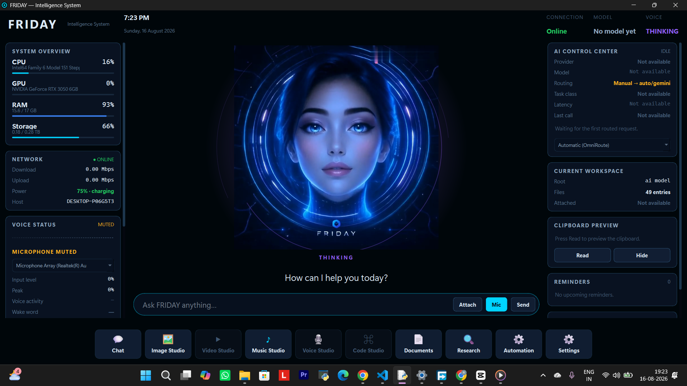
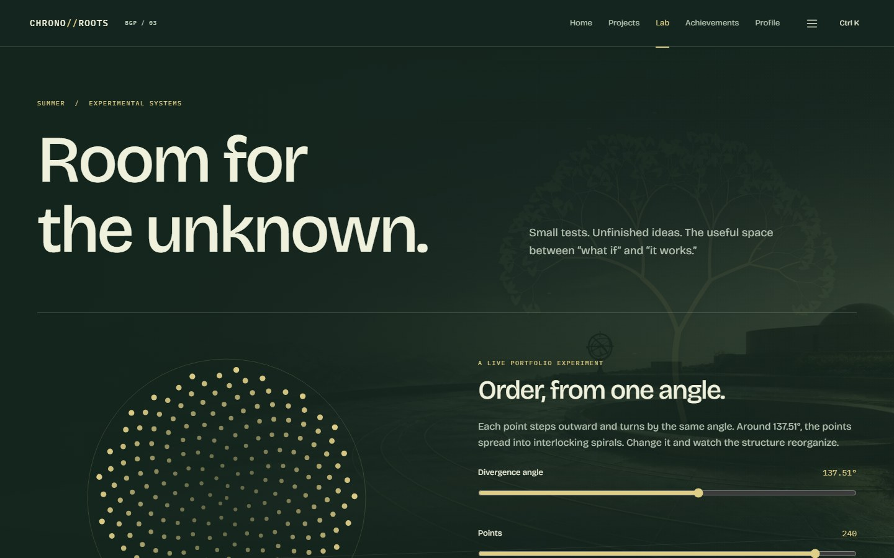
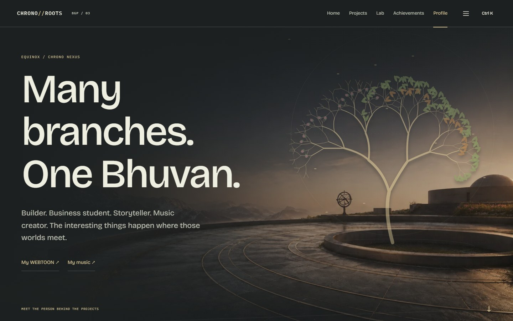
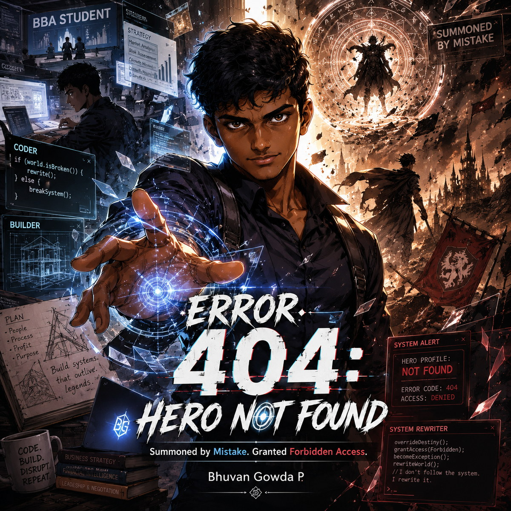
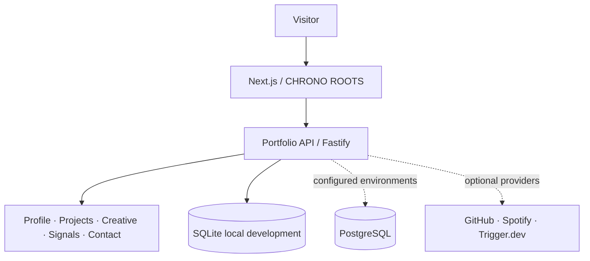

<div align="center">

<code>PORTFOLIO 3.0 · BGP / 03</code>

# CHRONO//ROOTS

### THE TEMPORAL HACKER ARCHIVE

**Bhuvan Gowda P**

`AI` · `SOFTWARE` · `BUSINESS` · `AUTOMATION` · `STORIES` · `SOUND`

A seasonal personal archive where technology, mathematics, nature, and creative work grow from the same roots.

<p>
  
  <a href="https://github.com/bhuvan5821n/Portfolio-3.0"></a>
  <a href="https://github.com/bhuvan5821n"></a>
</p>

</div>



CHRONO//ROOTS is my third-generation personal portfolio: a mobile-first archive built around seasons, a living world tree, real project evidence, interactive mathematics, and a 160-frame cinematic introduction.

It connects AI systems, software, business thinking, experiments, music, and storytelling without forcing every branch into the same shape.

---

## THE FIVE SEASONS

| Season | Archive route | Era | Principle |
| :--- | :--- | :--- | :--- |
| **WINTER** | Home | System Boot | Curiosity, with roots. |
| **AUTUMN** | Projects | The Inventor's Archive | Ideas, made tangible. |
| **SUMMER** | Lab | Experimental Systems | Room for the unknown. |
| **SPRING** | Achievements | The Academy | Growth leaves a record. |
| **EQUINOX** | Profile | Chrono Nexus | Many branches. One Bhuvan. |

The same persistent world tree changes with each route, turning navigation into a visual record of growth.

---

## INSIDE THE ARCHIVE

<table>
  <tr>
    <td width="50%">
      
      <br><sub><b>AUTUMN / PROJECTS</b> — ideas move from question to inspectable work.</sub>
    </td>
    <td width="50%">
      
      <br><sub><b>FRIDAY</b> — an authentic application capture from the personal assistant prototype.</sub>
    </td>
  </tr>
  <tr>
    <td width="50%">
      
      <br><sub><b>SUMMER / LAB</b> — live phyllotaxis turns one angle into visible order.</sub>
    </td>
    <td width="50%">
      
      <br><sub><b>EQUINOX / PROFILE</b> — technology, business, stories, and sound meet.</sub>
    </td>
  </tr>
</table>

---

## SIGNATURE SYSTEMS

| System | What it does |
| :--- | :--- |
| **160-frame scroll sequence** | Drives a bounded cinematic portrait through scroll, reverse playback, adaptive delivery, and constrained-device fallbacks. |
| **Seasonal world system** | Evolves one recursive tree through Winter, Autumn, Summer, Spring, and Equinox. |
| **FRIDAY Intelligence System** | Presents a real personal AI prototype with source-backed capabilities and authentic interface evidence. |
| **Interactive mathematics** | Lets visitors change a phyllotaxis divergence angle and watch the geometry reorganize. |
| **Creative branches** | Gives WEBTOON, music, and storytelling their own place beside software work. |
| **Evidence-first archive** | Labels built work, prototypes, experiments, and concept studies according to available evidence. |

---

## TECHNICAL FOUNDATION

| Layer | Technology in this repository |
| :--- | :--- |
| **Frontend** | Next.js 16, React 19, TypeScript, Tailwind CSS 4, Motion |
| **Experience** | Canvas rendering, procedural SVG, responsive layouts, browser animation and accessibility APIs |
| **Backend** | Node.js, TypeScript, Fastify 5, Zod, OpenAPI / Swagger |
| **Data** | Drizzle ORM, local SQLite via sql.js, PostgreSQL adapter and migrations |
| **Integrations** | Trigger.dev, GitHub, and Spotify providers prepared for credentialed environments |
| **Quality** | Playwright, Vitest, axe accessibility checks, ESLint, TypeScript |

### Verified technical arsenal

**Languages** — `Python` `JavaScript` `TypeScript` `C++` `Kotlin` `HTML` `CSS`

**Frameworks and runtime** — `React` `Next.js` `Node.js` `PyQt6` `Playwright`

**Builder workflow** — `Git` `GitHub` `PowerShell` `VS Code`

**AI systems** — AI assistants · LLM workflows · prompt engineering · model routing · context and memory · voice interfaces · screen awareness · browser automation

---

## PROJECTS INSIDE CHRONO//ROOTS

| Project | Status | Focus | Evidence |
| :--- | :--- | :--- | :--- |
| **FRIDAY** | `Prototype` | Windows assistant exploring voice, contextual memory, model routing, and tools | [Source](https://github.com/bhuvan5821n/Friday-and-Jarvis) |
| **HackScout** | `Built` | Hackathon discovery with traceable sources and deterministic ranking | [Source](https://github.com/bhuvan5821n/HackScout-AI) |
| **B.G. Finance** | `Built` | Offline-first Android expense tracking with local Room storage | [Source](https://github.com/bhuvan5821n/Finance-app) |
| **Markwell** | `Built` | Packaging-industry information, quote, and contact flows | [Source](https://github.com/bhuvan5821n/Markwell) · [Website](https://markwellpackaging.netlify.app/) |
| **Portfolio Evolution** | `Built` | Three generations leading to this seasonal archive | [Earlier source](https://github.com/bhuvan5821n/Portfolio) |

### Concepts / experiments

| Project | Status | Current scope |
| :--- | :--- | :--- |
| **FleetMind AI** | `Concept study` | A proposed maintenance-risk decision workflow for commercial fleets. |
| **Grain-Za** | `Concept study` | A grain-based snack, packaging, and business-story exploration. |
| **Space Shooter** | `Documentation in progress` | A small arcade project whose implementation evidence is being organized. |
| **Procedural Frontier** | `Experiment` | A question about how generated worlds can keep inviting exploration. |

---

## BEYOND CODE

<table>
  <tr>
    <td width="190">
      <a href="https://www.webtoons.com/en/canvas/error-404-hero-not-found/list?title_no=1168738"></a>
    </td>
    <td>
      <h3>ERROR 404: HERO NOT FOUND</h3>
      <p>A fantasy/comedy series on <a href="https://www.webtoons.com/en/canvas/error-404-hero-not-found/list?title_no=1168738">WEBTOON CANVAS</a>. A BBA student is summoned into a world whose hero system cannot identify him, so he starts rewriting its rules.</p>
      <h3>Music / Spotify</h3>
      <p>Original sound lives on the <a href="https://open.spotify.com/artist/7MerLC0ZGytRkTf9mSBfS4">bhuvan5821n artist profile</a>. Storytelling and sound are first-class creative work in this archive.</p>
    </td>
  </tr>
</table>

---

## ARCHITECTURE



The frontend keeps verified local content as a fallback when the API is unavailable. External providers remain configuration-dependent.

---

## RUN LOCALLY

```powershell
git clone https://github.com/bhuvan5821n/Portfolio-3.0.git
cd Portfolio-3.0
npm install
npm run dev
```

Start the API in a second terminal:

```powershell
cd backend
npm install
npm run dev
```

The frontend defaults to `http://localhost:3000`; the API defaults to `http://127.0.0.1:3001`. Copy the safe `.env.example` files when local overrides are needed.

<details>
<summary><b>Build and validation commands</b></summary>

```powershell
# Frontend
npm run lint
npm run typecheck
npm run build
npm run test:e2e

# Backend
cd backend
npm run typecheck
npm run test
npm run build
```

</details>

### Project map

```text
app/          routes, metadata, API proxy, and seasonal pages
components/   interface, project, profile, and intro systems
data/         verified local portfolio records and manifests
public/       seasonal media, project evidence, and frame delivery
backend/      Fastify API, schema, repositories, providers, and tests
scripts/      frame processing and verification utilities
tests/        Playwright interaction, responsive, runtime, and a11y coverage
```

---

## CURRENT STATUS

| Area | State |
| :--- | :--- |
| Frontend | **Production candidate** |
| Portfolio API | **Integrated** — local SQLite operation and content fallbacks are available |
| Current Portfolio 3.0 deployment | **Pending** |
| Trigger.dev | **Prepared** — requires credentials |
| GitHub provider | **Optional** — requires configuration |
| Spotify provider | **Optional** — requires configuration |
| PostgreSQL | **Prepared** — requires `DATABASE_URL` |

---

<div align="center">

### BUILD. BREAK. LEARN. GROW.

**Curiosity, with roots.**

[GitHub](https://github.com/bhuvan5821n) · [Instagram](https://www.instagram.com/bhuvan5821na/) · [WEBTOON](https://www.webtoons.com/en/canvas/error-404-hero-not-found/list?title_no=1168738) · [Spotify](https://open.spotify.com/artist/7MerLC0ZGytRkTf9mSBfS4) · [Portfolio source](https://github.com/bhuvan5821n/Portfolio-3.0)

</div>
